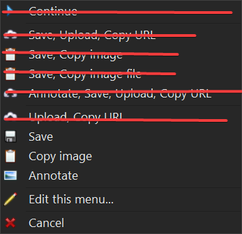
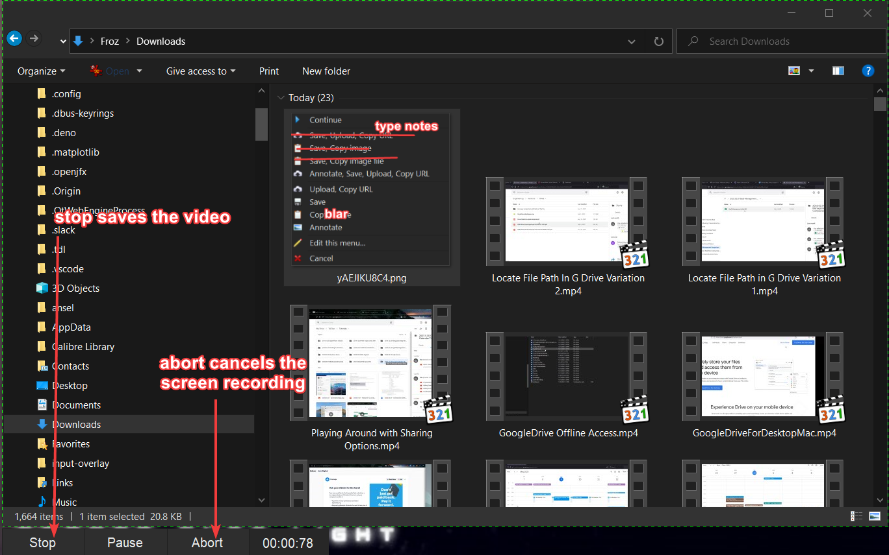
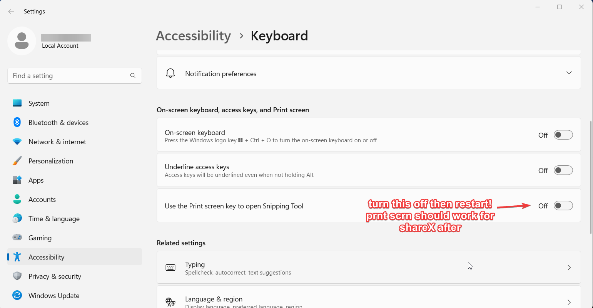
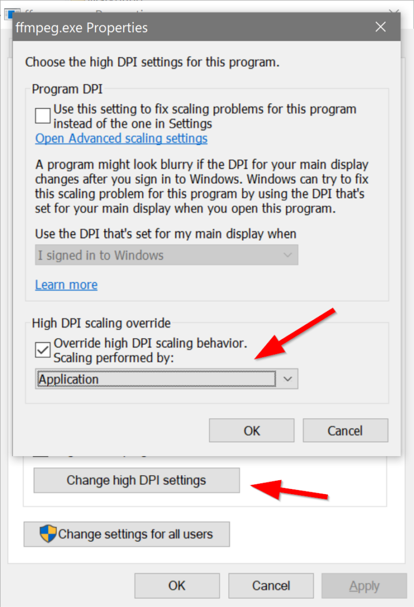
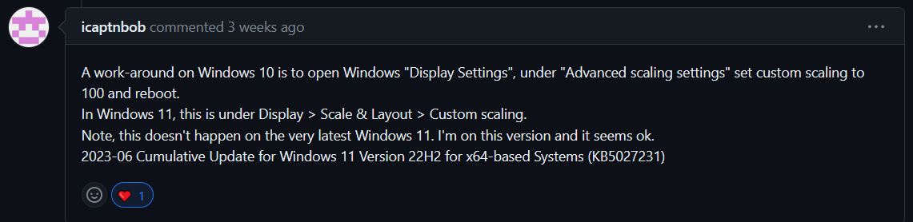

# ShareX Best Windows Screenshot Tool

# I. Installation

In my opinion, it’s the best screenshot + screen recorder for Windows! Loads of productivity.

> [!NOTE]
> Start by downloading and installing ShareX it here: [https://getsharex.com/downloads](https://getsharex.com/downloads "https://getsharex.com/downloads") choose the one ending in  “-setup.exe”

## Getting my Config Loaded

This config is recommended. Go ahead and download the config below. Optionally you can find out what it does [here](./ShareX%20Best%20Windows%20Screenshot%20Tool/What%20the%20.sxb%20config%20does.md).

[ShareX-15.0.0-frozconfig.sxb 15074](uploads/58040d4f-6956-478b-af72-b8669af438e0/d4e822e5-892f-45a6-bd53-136d4b415bcb/ShareX-15.0.0-frozconfig.sxb)

After downloading….

https://github.com/StarWhiz/sharex/assets/9423276/358b254b-5d2a-4676-ac5a-3b6976a6b3f5

Go to ShareX icon on the bottom right of your Taskbar and right click it. Then go to Application Settings… 

After that go to Integration on the left sidebar.  Check the Show **“Edit with ShareX”** box.

Then go to Settings on the left sidebar and import the .sxb file you downloaded earlier!

That’s it! Now you’re ready to use ShareX

# II. Basic Usage: Screenshots
> [!TIP]
> If your “prnt scrn” button opens the Windows snipping tool or doesn’t work try [this](https://github.com/StarWhiz/sharex/blob/main/README.md#prnt-scrn-doesnt-work)

This is as easy as pressing **“Prnt Scrn”** on your keyboard. Then either

* hover over the window you’d like to capture and left click
* select a corner you want to start at and drag the rectangle to your preferred capture area.

From there you can do the following:

 

* Save - This saves the screenshot. A thumbnail appears in the bottom right corner. Click it to automatically open the folder that it saved to.

[PRO TIP: Saving first then clicking the thumbnail that appears on the bottom right opens the folder where it saves! 1918x1074](uploads/58040d4f-6956-478b-af72-b8669af438e0/bc9ea3e5-fc43-4028-b35c-ac2df2bd2477/Save%20And%20clicking%20Thumbnail%20opens%20folder.mp4)

https://github.com/StarWhiz/sharex/assets/9423276/33bf2801-8b1a-449f-b76c-f9f21fe296ad

* Copy image - This copies the image to your clipboard. Try pasting it in a Discord message for practice!

https://github.com/StarWhiz/sharex/assets/9423276/bf95e192-4326-4b05-9c13-714f7ab33edb

* Annotate - Lets you edit the image before you either copy it to clipboard or save it. You can also use it as a temporarily note taking window and choose to close it if you don’t need it.

https://github.com/StarWhiz/sharex/assets/9423276/c278532c-ac0a-4eb7-ba78-c99dbad6755c

> [!WARNING]
> Please note, you can only have up to 5 annotate windows open. If you have more than 5 you'll have to start closing some for new ones to show up.

> [!TIP]
> Pro Tip: Sometimes I use the annotate feature as a temporary window that I can reference on a different monitor or screen and then close it without saving.

## Re-annotating image

To do this right click on the image you saved and click “Edit with shareX”

https://github.com/StarWhiz/sharex/assets/9423276/833cffaa-815b-4f54-a548-a27516976018

# III. Basic Usage: Screen Recordings

This is as simple as pressing **“Shift + Prnt Scrn”** on your keyboard. Then either

* hover over the window you’d like to capture and left click
* select a corner you want to start at and drag the rectangle to your preferred capture area.

That’s it! You can save the recording by pressing **“Shift + Prnt Scrn”** again or you can use the controls that appear on the bottom left.

 

## Voiceovers

You can do voiceovers as you screen record by doing the following.

* Right-click on the ShareX icon
* Click “Task settings”
* On the new window sidebar, click “Screen recorder” under “Capture”
* Click “Screen recording options…”
* Under “Audio source:” choose your preferred microphone.
* That’s it! Now take a screen recording and talk!

https://github.com/StarWhiz/sharex/assets/9423276/178a873c-43dd-4475-ba2f-3b2f3a3e18aa

# Troubleshooting

# Prnt Scrn Doesn’t work!

This is probably because you’re on Windows 11. 

Just disable the “Use the Print screen key to open Snipping Tool” in Settings > Accessibility > Keyboard

 

# Mouse Cursor Off Center During Recording

Solution Source: <https://helgeklein.com/blog/sharex-free-screen-recording-tool-mouse-pointer-offset-high-dpi-fix/>

 

If you’re recording on a high-DPI display, e.g., a 4K monitor, you’ll notice a mouse pointer offset: the mouse pointer is not where it’s supposed to be in the video.

This is caused by FFmpeg not being fully high-DPI aware as [documented here](https://github.com/rdp/screen-capture-recorder-to-video-windows-free/issues/56 "https://github.com/rdp/screen-capture-recorder-to-video-windows-free/issues/56"). Luckily it can be fixed easily:

* Locate the `FFmpeg.exe` inside the ShareX default install (downloaded to `%USERPROFILE%\Documents\ShareX\Tools`
* Right-click the executable and select **Properties** in the context menu.
* Click the **Compatibility** tab and select **Change high DPI settings**.
* Click **Override high DPI scaling behavior. Scaling performed by: Application**.
* The result should look similar to the screenshot above.

# Text is too big on 4K displays

 

Note: setting custom scaling to 125% or 150% also works as well.
